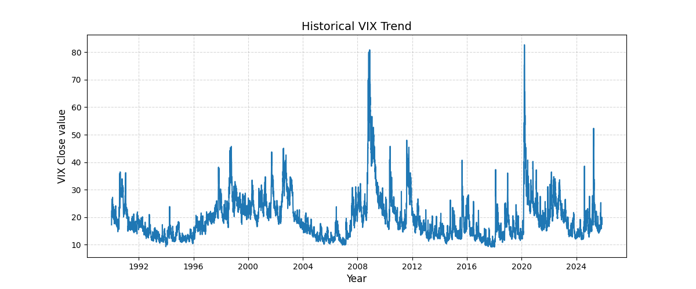
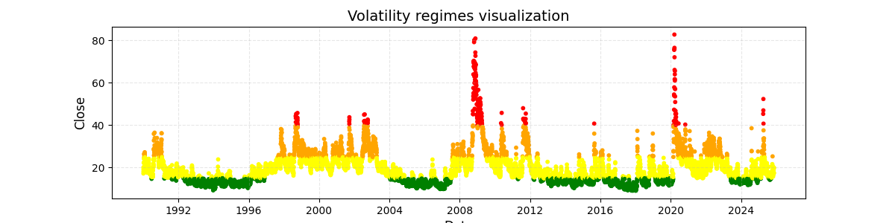

# 📉 VIX Analysis: Mapping Market Fear
**A quantitative study of S&P 500 volatility regimes using Python.**

This project explores the historical behavior of the CBOE Volatility Index (VIX) from 1990 to late 2025. I developed a script to identify different "Volatility Regimes", distinguishing between market complacency and periods of extreme financial stress.

## Analytical Approach
I implemented several quantitative indicators to measure market tension:

- **Volatility Regimes:** Classification of market states (Calm vs. Stress) based on threshold analysis.
- **Intraday Dynamics:** Calculation of Daily Ranges to capture "hidden" volatility within trading sessions.
- **Statistical Properties:** Analysis of Log Returns and Realized Volatility to understand the speed of market reversals.
- **Trend Smoothing:** Use of Moving Averages to filter noise from the "Fear Index."

## Visualizations
 
*Historical trend showing the VIX evolution over 35 years.*

*Identification of volatility clusters and market stress regimes.*

## Tech Stack
- **Language:** Python
- **Data Handling:** `pandas` (for time-series manipulation).
- **Visualization:** `matplotlib` (for generating historical trend plots).

## Data & Sources
* **Source:** Data was retrieved from [Github](https://github.com/datasets/finance-vix).
* **Dataset:** The specific CSV file used (1990 - 2025) is available [here](./vix-daily.csv).
