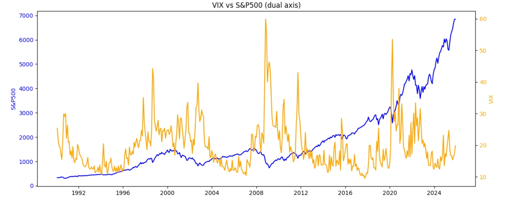
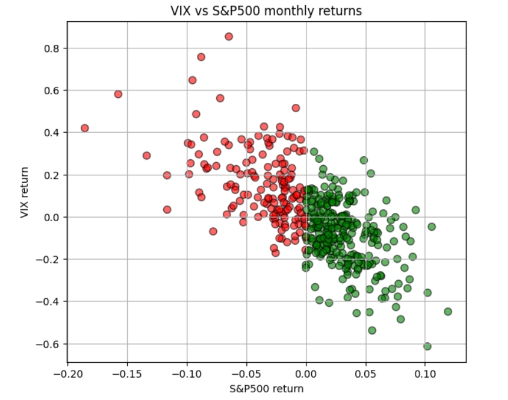

# 📉 VIX Analysis & S&P 500 Comparison
**A quantitative study of market volatility and equity behavior using Python.**

This project analyzes the CBOE Volatility Index (VIX) from 1990 to 2025 and compares it
with the S&P 500 to identify volatility regimes and their relationship with equity returns.

---

## What This Project Does

Starting from daily VIX data, the analysis classifies market conditions into volatility
regimes and then cross-references them with monthly S&P 500 returns to quantify
how fear and equity performance interact over time.

---

## Key Analyses

- **Volatility Regimes*: markets are classified as Calm or Stress based on VIX thresholds,
  making it easy to isolate periods of elevated fear
- **Returns & Dynamics**: daily and monthly log returns, intraday ranges, and realized
  volatility capture how the market moves within each regime
- **Trend Smoothing**: moving averages filter noise and highlight long-term structural trends
- **VIX vs S&P 500**: monthly comparison using dual-axis plots to preserve scale,
  showing the typical inverse relationship between volatility and equity returns
- **Rolling Correlation**: 12-month rolling correlation tracks how the VIX-equity
  relationship evolves across different market cycles

---

## Visualizations

  

  

  

  

---

## Data & Sources

### VIX
- **Source:** CBOE Volatility Index time series available on [GitHub finance-vix dataset](https://github.com/datasets/finance-vix)
- **Dataset file used in this project:** available [here](./vix-daily.csv)

### S&P 500
- **Source:** S&P 500 historical monthly data on [Macrotrends](https://www.macrotrends.net/2324/sp-500-historical-chart-data#google_vignette)
- **Dataset file used in this project:** available [here](./sp500.csv)

---

## Libraries Used

| Library | Purpose |
|---|---|
| `pandas` | Data loading and manipulation |
| `numpy` | Numerical calculations and log returns |
| `matplotlib` | All visualizations |
